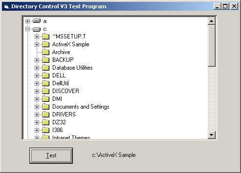



## Directory Tree V3\.0

### Description

I've looked around and have not been able to find a decent treeview control that will diplay the Drives and folders on a machine and isnt too much bother to use. I made this control for a setup program i'm writing but you can all use it ;)

----

I have actually included the .ctl file :) 

----

There are two projects in the zip file. DirTreeV3.vbp and all associated files are the actual control itself. I have included a compiled version of the ocx all you have to do is register it and you can use it. Ive also included an example program to show you how to use the control. It's dead simple to use anyway just one line of code in your main program. If you like it .... Vote for it ;)
 
### More Info
 
To use the control you'll need to register it first. To do this goto start menu and click run. in the text box type the following.

regsvr32 "<path & file Name>"

e.g. on my machine it would look like this

Regsvr32 "C:\DirTree\DirTreeV3.ocx"

             |
---                |---
**Submitted On**   |2001-05-01 11:40:12
**By**             |[Liam Powney](https://github.com/Planet-Source-Code/PSCIndex/blob/master/ByAuthor/liam-powney.md)
**Level**          |Intermediate
**User Rating**    |4.3 (26 globes from 6 users)
**Compatibility**  |VB 6\.0
**Category**       |[OLE/ COM/ DCOM/ Active\-X](https://github.com/Planet-Source-Code/PSCIndex/blob/master/ByCategory/ole-com-dcom-active-x__1-29.md)
**World**          |[Visual Basic](https://github.com/Planet-Source-Code/PSCIndex/blob/master/ByWorld/visual-basic.md)
**Archive File**   |[Directory 19071512001\.zip](https://github.com/Planet-Source-Code/liam-powney-directory-tree-v3-0__1-22840/archive/master.zip)

